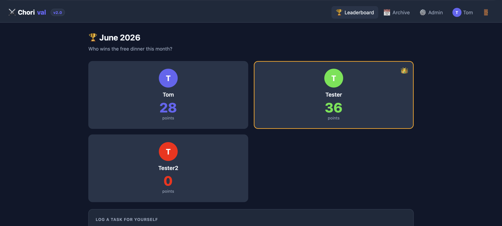
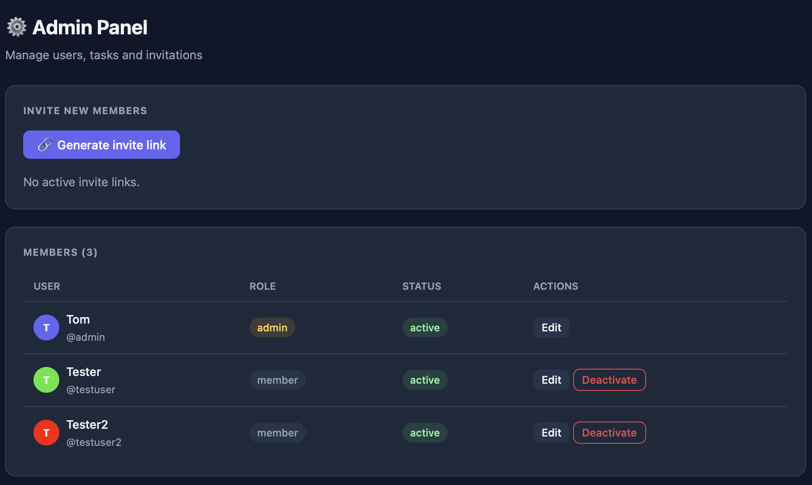
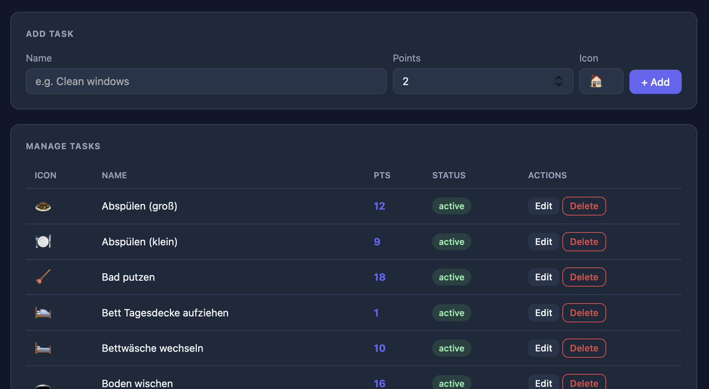
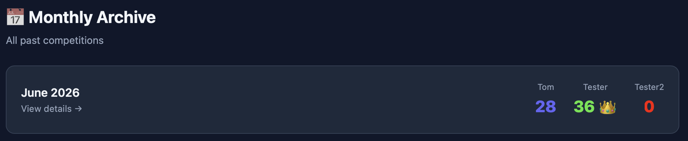

# ⚔️ Chorival

A self-hosted web app for a monthly household chores competition.  
Complete tasks, earn points, and win a free dinner at the end of the month!



---

## Features

- **Live leaderboard** with point totals for all players
- **One-click task logging** – just pick a task, points are added instantly
- **Per-user accounts** – everyone has their own login
- **Invite system** – admin generates invite links, no open registration
- **Task suggestions** – members can suggest new tasks, admin approves or rejects them
- **Admin panel** – manage users, tasks and invitations
- **Monthly archive** – all past competitions with results
- **Profile page** – change display name, color and password
- **Version badge** – always visible in the navbar





---

## Roadmap

| Version | Status | Content |
|---|---|---|
| v1.0 | ✅ Released | 2-player app, Flask, global password |
| v2.0 | ✅ Released | Multi-user, per-user login, invite system, FastAPI |
| v2.1 | 🔜 Planned | Task categories, streaks, bonus points |
| v2.2 | 🔜 Planned | Weekend bonus points, recurring task intervals |
| v2.3 | 🔜 Planned | Email notifications, overdue task dashboard |
| v3.0 | 🔜 Planned | Mobile app, Home Assistant integration |

---

## Quick Start

### Requirements

- Docker
- Docker Compose

### 1. Clone or download

```bash
git clone https://github.com/burninghead13/chorival.git
cd chorival
```

### 2. Configure

Edit `docker-compose.yml` and set your own values:

```yaml
environment:
  - ADMIN_USERNAME=admin
  - ADMIN_DISPLAY_NAME=Admin
  - ADMIN_PASSWORD=your-secure-password
  - SECRET_KEY=your-long-random-string
```

Generate a secure secret key:
```bash
openssl rand -hex 32
```

### 3. Start

```bash
docker compose up -d --build
```

The app is now available at:
```
http://<your-server-ip>:8096
```

---

## First Steps After Deployment

1. **Log in** with the admin credentials from `docker-compose.yml`
2. **Go to Admin** → generate an invite link
3. **Share the link** with the other players – they register themselves
4. **Customize tasks** in the Admin panel to fit your household
5. Start competing! 🏆

---

## Invite System

Only the admin can invite new users. To add someone:

1. Admin panel → **Generate invite link**
2. Copy the link and send it to the person
3. They open the link and create their account
4. Links are valid for **7 days** and can only be used **once**

---

## User Roles

| Role | Permissions |
|---|---|
| **Admin** | Full access – manage users, tasks, invitations, delete any entry |
| **Member** | Log tasks, suggest new tasks, edit own profile, delete own entries |

---

## Management

```bash
# View logs
docker compose logs -f chorival

# Restart
docker compose restart chorival

# Update after code changes
docker compose up -d --build

# Stop
docker compose down
```

---

## Data & Backups

All data is stored in a SQLite database inside the Docker volume `chorival-data`.  
It survives container restarts and updates automatically.

Create a backup:
```bash
docker cp chorival:/data/chorival.db ./chorival-backup-$(date +%Y%m%d).db
```

> ⚠️ Never run `docker compose down -v` – the `-v` flag deletes all volumes including your data.

---

## Migrating from Haushalt App (v1.0)

Chorival v2.0 uses a separate database and is not backwards compatible with the old Haushalt app. The recommended approach is a fresh start:

1. Deploy Chorival v2.0 alongside the old app (different port)
2. Re-create your tasks in the Admin panel
3. Once happy with Chorival, shut down the old app with `docker compose down` in its directory

The old `haushalt.db` is untouched and can be kept as an archive.

---

## Default Tasks

| Task | Points |
|---|---|
| Vacuuming | 3 |
| Mopping | 4 |
| Dishes | 2 |
| Grocery shopping | 3 |
| Doing laundry | 3 |
| Hanging laundry | 2 |
| Taking out trash | 2 |
| Cleaning bathroom | 4 |
| Cooking | 3 |

All tasks can be adjusted, deactivated or deleted in the Admin panel.  
Members can also suggest new tasks which the admin can approve or reject.

---

## Tech Stack

- **Backend:** FastAPI (Python)
- **Database:** SQLite via SQLAlchemy
- **Frontend:** Jinja2 templates + HTMX
- **Auth:** JWT (cookie-based) + bcrypt
- **Deployment:** Docker + Docker Compose
